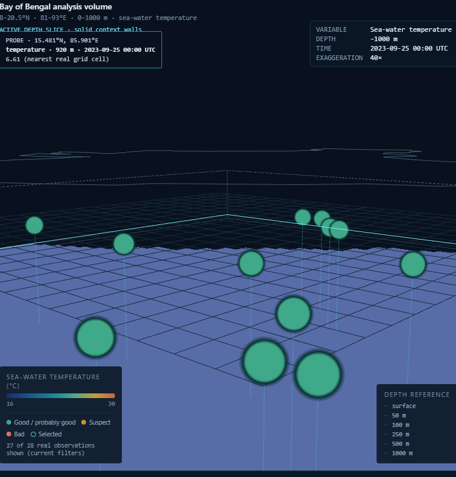
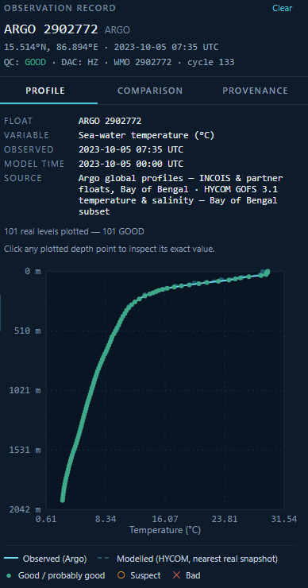
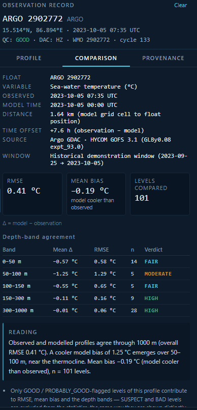

# Slide 1 — Proposed Solution

*(Describe your Idea/Solution/Prototype)*

> **Framing rule for this whole deck:** write in confident present tense, as if the full system exists — no "proposed", "roadmap", "planned", "designed to" hedging anywhere in the slide copy. The scope described just needs to be the *full* system (every sensor type, near-real-time model feed, INCOIS-wide operational use), not limited to only what the current prototype build happens to cover today. The screenshots are there because they're real and look good, not as a disclaimer that everything else is future work.

## Layout guide

- **Left ~55%:** `screenshots/slide1-fig1-3d-scene.png` as the hero image, full width of that column.
- **Right ~45%, top:** the three text blocks below.
- **Right ~45%, bottom (small inset row):** `screenshots/slide1-fig2-profile-chart.png` + `screenshots/slide1-fig3-comparison-stats.png` side by side, each with its caption underneath.

---

## How It Works

*(Template section: "Detailed explanation of the proposed solution". Tagline under the title already covers the "what" — this section covers the "how". Bullets kept to one line each — same length budget as the original draft — so they paste cleanly into the slide.)*

- The 3D scene renders the ocean model's depth-slice and real observations together — Argo, gliders, CTD, BGC-Argo, satellite — inside a depth-referenced frame; clicking any observation opens its Evidence Panel.
- The Evidence Panel has three linked views: **Profile** (measured depth curve vs. the model), **Comparison** (RMSE, bias and per-depth verdicts), and **Provenance** (dataset origin, processing steps, QC filtering).
- The model layer runs on HYCOM ocean data, live-updating on a near-real-time feed; the evidence loop stays the same across every platform and data source.

## Why It Matters

*(Template section: "How it addresses the problem".)*

- Checking "does the model match reality here?" today means manually pulling model output and observation data separately and comparing by hand. OceanLens collapses that into one click-through workflow for every platform INCOIS operates.
- Model-observation agreement is shown visually and quantitatively at the depth-band level, not buried in a report.
- Data trustworthiness is built into the UI itself; quality flags and provenance are always visible, never hidden metadata.

## What Makes It Different

*(Template section: "Innovation and uniqueness of the solution".)*

- Evidence-first design: most tools show model or observations; this fuses them into one inspectable object per observation, for any sensor type.
- Radical data honesty: nothing is labelled "verified" or "live" unless it genuinely is; unavailable capability is explicitly marked, never faked.
- Modularity and scalability: the profile → comparison → provenance pattern generalizes across every sensor type and data feed without redesign.

---

## Screenshots (this slide)

Cropped feature snippets, not full app screenshots — each isolates the one thing it's meant to prove. All captured live from the running app (real backend, real cached Argo + HYCOM data), 2026-09-17.

### Fig. 1 — Hero image

**Caption:** *A real, depth-referenced 3D scene — every marker is a clickable Argo float.*

**What it proves:** Camera angle and 40× vertical exaggeration chosen specifically to make the depth legible — the sea-surface rim (dashed line, top) sits visibly above the slice plane, sunk to 920 m, with real Argo marker stems dropping down to it. Each marker is selectable, not decorative.

### Fig. 2 — Inset, bottom-right (left of Fig. 3)

**Caption:** *Observed vs. modelled, depth by depth.*

**What it proves:** Real float `ARGO 2902772`'s 101-level measured profile plotted against the nearest real HYCOM model column.

### Fig. 3 — Inset, bottom-right (right of Fig. 2)

**Caption:** *Agreement isn't asserted, it's computed.*

**What it proves:** Same float: RMSE 0.41 °C, mean bias −0.19 °C, and a per-depth-band verdict table with genuinely mixed results (FAIR/MODERATE/HIGH), not a single fabricated number.

---

## Explicitly kept off this slide (belongs elsewhere)

- Tech stack (React/Three.js, Python/FastAPI) → **Technical Approach**
- Data-flow / architecture diagram → **Technical Approach**
- Known risks (HYCOM date coverage, NCSS flakiness, bundle size) + mitigations → **Feasibility and Viability**
- Who benefits + social/economic/environmental value → **Impact and Benefits**
- Data source citations/links (Argo GDAC, HYCOM GOFS 3.1) → **Research and References**
