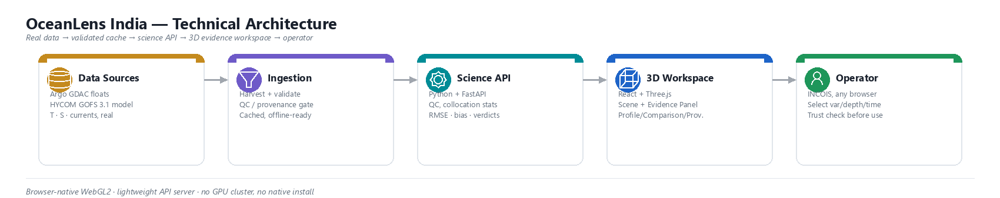

# Slide 2 — Technical Approach

*(Technologies to be used / Methodology and process for implementation)*

> Same deck-wide framing rule as Slides 1 and 4: confident present tense, full system scope, no "proposed"/"planned" hedging. Bullets kept to one line each so they paste cleanly into the slide template.

- **Top, full width:** `screenshots/slide2-fig1-architecture-methodology.png` — a compact single-row, 5-stage architecture diagram (Data Sources → Ingestion → Science API → 3D Workspace → Operator), colour-coded badges, one line of tech + one line of detail per stage, arrows between.
- **Below it:** `Technologies` and `Methodology` bullets — the diagram carries the visual stack at a glance; the bullets add the framing prose (testing/verification process) the diagram deliberately leaves out to stay compact.

---

## Technologies

*(Template section: "Technologies to be used — programming languages, frameworks, hardware".)*

- **Frontend:** React 19 + TypeScript (strict) + Vite; Three.js for the WebGL 3D scene; Zustand for state; hand-rolled SVG charts — no chart library, no UI framework dependency beyond React.
- **Backend:** Python + FastAPI serving the science layer — QC filtering, depth interpolation, collocation statistics (RMSE, bias, depth-band agreement) — computed per-request, never hard-coded.
- **Data:** real Argo GDAC float profiles (INCOIS + partner DACs) and HYCOM GOFS 3.1 ocean model fields (temperature, salinity, currents), validated and cached for offline, low-latency serving.
- **Scheduling:** a cron-driven ingestion job re-runs the harvest → validate → cache pipeline on a fixed interval, so the science API always serves a freshly validated snapshot instead of a one-time static pull.
- **Hardware:** runs entirely browser-native over WebGL2 — no GPU cluster, no native client install; deployable on standard INCOIS server hardware plus any modern browser.

## Methodology

*(Template section: "Methodology and process for implementation — Flow Charts/Images/working prototype".)*

- Development proceeds in gated phases — real data sourcing and validation first, then the science/domain model, then the backend API, then the 3D scene and Evidence Panel — each phase fully tested before the next begins.
- Every phase is verified the same way: automated unit + integration tests, a clean typecheck/build, and a live browser check against the real running backend — not just code review.
- The working prototype (Slides 1 and 4) is the direct output of this process on real cached Argo + HYCOM data, not a mockup built separately from the engineering.
- A dedicated correctness-hardening and accessibility/responsive-QA pass closes every phase, catching and fixing real defects (e.g. layout overflow at narrow viewports, backend timestamp-snapping bugs) before moving forward.
- Data freshness is a scheduled process, not a one-off load: a cron job periodically re-triggers ingestion, and the same validation gate that guards the initial harvest guards every re-run — a bad or incomplete pull is rejected before it ever reaches the cached manifest the API serves from.

---

## Fig. 1 — Technical architecture

**Caption:** *Real data to operator in five stages: sources → ingestion/validation → science API → 3D evidence workspace → INCOIS operator. Ingestion is triggered on a scheduled (cron) interval, not a one-time load.*

**Note for the diagram's next revision:** the current image has no visible trigger for the "Ingestion & Validation Scripts" box — it reads as a manual/one-shot step. If re-exporting from Claude Design, add a small `⏰ Scheduler (cron)` badge/arrow feeding into that box in zone 01→02, matching the caption above. Not blocking — the bullets below already carry this content — but worth fixing if the diagram gets regenerated anyway.

---

## Explicitly kept off this slide (belongs elsewhere)

- The core idea, workflow, and why it matters → **Proposed Solution**
- Risks and mitigations (e.g. HYCOM date coverage, source flakiness) → **Feasibility and Viability**
- Who benefits and the instrument-fault discovery → **Impact and Benefits**
- Data source citations/links → **Research and References**
