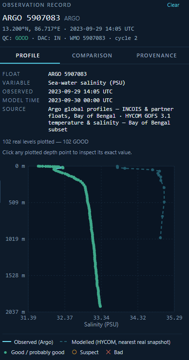

# Slide 4 — Impact and Benefits

*(Potential impact on the target audience / Benefits of the solution — social, economic, environmental, etc.)*

> Same deck-wide framing rule as Slide 1: confident present tense, full system scope, no "proposed"/"planned" hedging. Bullets are kept to one line each so they paste cleanly into the slide template.

## Layout guide

- **Left ~55%:** `Who It Impacts` and `The Benefits` text blocks, stacked.
- **Right ~45%:** the `A Real Discovery` callout box (cream/highlight box, matching the "Why It Matters" callout style from Slide 1) with `screenshots/slide4-fig1-salinity-anomaly.png` inset and its caption below.

---

## Who It Impacts

*(Template section: "Potential impact on the target audience".)*

- INCOIS forecasters and operations teams verify model trust at the exact depth and location an advisory depends on, before it ships.
- Marine and climate researchers reuse one evidence loop across every variable and platform instead of writing one-off comparison scripts per study.
- India's ocean-science community gets a fully open pipeline — public Argo and HYCOM data, open methodology — reproducible and extendable by any institution.
- Disaster management and coastal authorities get the same trust signal feeding directly into cyclone, upwelling, and current advisories.

## The Benefits

*(Template section: "Benefits of the solution — social, economic, environmental, etc.".)*

- **Scientific / open-source:** the entire evidence pipeline runs on public data and an open methodology, promoting reproducible, auditable ocean research across Indian institutions, not a closed black box.
- **Social:** safer, better-informed coastal advisories for fishing communities and coastal populations, backed by a visible trust signal instead of an opaque forecast.
- **Economic:** cuts the analyst-hours INCOIS spends manually cross-checking model output against float data, depth by depth.
- **Environmental:** strengthens the ocean-observing network itself by surfacing failing sensors early, before bad data propagates into forecasts or research.

## A Real Discovery: Instrument-Fault Detection

*(A genuine second use case found while using the system on real cached data — not a hypothetical.)*

- Argo float `5907083`'s salinity profile (Bay of Bengal, 2023-09-29) stays pinned near 32–33 PSU from 200 m down to almost 2000 m depth — while its temperature profile looks completely normal.
- No real ocean location holds salinity that fresh at that depth; the float's own standard QC flag still reads GOOD, so this anomaly would pass a routine quality check unnoticed.
- The Comparison view makes it obvious: the model's salinity sits roughly 2 PSU above the float's own reading at every depth past 200 m — the size and shape of a conductivity-sensor fault, not an ocean signal.
- OceanLens is a model-validation tool and an instrument-health monitor for the observing network in one workspace — the same evidence loop catches both kinds of error.

### Fig. — Model vs. a failing sensor

**Caption:** *The model (dashed) and the float's own reading (solid) disagree by ~2 PSU below 200 m — a real instrument fault, caught by the same view built to check the model.*

---

## Explicitly kept off this slide (belongs elsewhere)

- Detailed technical implementation and architecture → **Technical Approach**
- Risk/mitigation discussion → **Feasibility and Viability**
- Data source citations/links → **Research and References**
